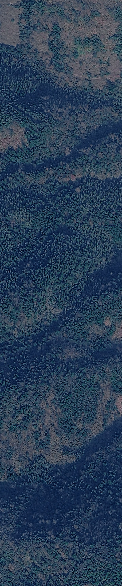
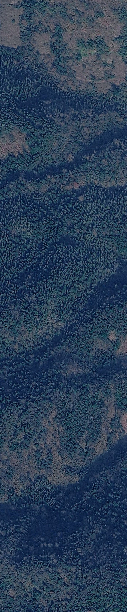

# 国内反代地图图源 + 卫星影像瓦片下载拼接工具

一套**在国内无需科学上网、无需 API Key** 即可直接使用的地图图层源解决方案，配套一个图形化的卫星影像瓦片下载拼接工具。

- 🛰️ **谷歌卫星/混合/路网/地形影像**：通过反向代理在国内直连抓取，最高实测 **z21**（约 0.1 米/像素）
- 🧭 **9 种坐标系输入**：WGS-84 / CGCS2000 / GCJ-02 火星 / BD-09 百度 / ITRF / NAD83 / ETRS89 / Web Mercator / UTM
- ⌨️ **两种坐标输入方式**：小数度（29.36178）或 度分秒（`29°21'42.4"`、`29 21 42.4`、`29d21m42.4sN`）
- 📊 **下载前信息面板**：各级瓦片数量与容量（MB）、当前区域实际可抓取的最高级别、矩形宽高（米，1 位小数）
- 🖼️ **自动拼接**：下载完成后自动拼接并按经纬度精确裁剪，输出整张 JPG
- 📦 **单级下载 / 打包 ZIP**：>100MB 弹窗确认，>300MB 强制拒绝并建议分拆下载
- 🗺️ **多形态图源产物**：图源库 JSON、QGIS 可导入连接、双击即用的 Leaflet 本地预览页

---

## 📁 仓库内容

| 文件 | 说明 |
|---|---|
| `卫星影像瓦片下载器.py` | ⭐ 主工具：图形界面瓦片下载拼接器（tkinter，无需额外 GUI 依赖） |
| `地图图层源获取.py` | 反代健康检查 + 生成整套可用图源目录（JSON / QGIS ini / Leaflet 预览页） |
| `map_sources.json` | 生成产物：10 个实测可用图源库（含验证状态、实际最高级别、偏移警告） |
| `qgis_xyz.ini` | 生成产物：QGIS `[connections-xyz]` 格式连接片段 |
| `map_preview.html` | 生成产物：双击即用的本地多图层预览页（Leaflet，含 AOI 矩形） |
| `拼接成果/` | 示例产物：谷歌卫星 z17~z21 自动拼接整图（湖南某乡村区域） |

## 🖼️ 拼接成果预览

z21 级拼接图（2804 × 13450 像素，648 张瓦片自动拼接，约 0.09 m/像素）：



z19 级拼接图（2 倍放大预览，60 张瓦片）：



> 示例区域：左上 (29.36178°N, 113.70284°E) ～ 右下 (29.36964°N, 113.70472°E)，
> 矩形 **宽 182.4 m × 高 873.5 m**，各级实测容量：z17=0.16MB、z18=0.48MB、z19=0.87MB、z20=1.99MB、z21=5.38MB。

---

## 🛠️ 环境要求与安装

- Python **3.8+**（Windows / macOS / Linux 均可；Windows 3.13 实测通过）
- 第三方依赖仅 2 个：

```bash
pip install requests Pillow
```

> tkinter 是 Python 自带的，无需安装。

自检（可选，验证坐标转换 / 度分秒解析 / 网络取瓦片全部正常）：

```bash
python 卫星影像瓦片下载器.py --selftest
```

## 🚀 快速开始（GUI 下载器）

```bash
python 卫星影像瓦片下载器.py
```

### 第 1 步：输入左上角 / 右下角坐标

顶部单选切换两种输入方式：

| 方式 | 示例（均可识别） |
|---|---|
| 小数度 | `29.36178` |
| 度分秒 | `29°21'42.4"`、`29 21 42.4`、`29d21m42.4s`、`21°42.4′N`（带 N/S/E/W 或 南北东西 均可） |

### 第 2 步：选择输入坐标系

下拉框选择你手里这组坐标**当前使用的坐标系**，程序会自动换算为 WGS-84 去取瓦片：

| 坐标系 | 典型来源 |
|---|---|
| WGS-84 | GPS 设备、谷歌地球、国际通用 |
| CGCS2000 | 国内测绘法定成果（与 WGS-84 差异厘米级，可视为一致） |
| GCJ-02 火星 | 高德 / 腾讯地图拾取的坐标（**偏移约 500m，务必选对**） |
| BD-09 百度 | 百度地图拾取的坐标 |
| ITRF | 国际地球参考框架（GNSS 精密解算） |
| NAD83 / ETRS89 | 北美 / 欧洲大地基准 |
| Web Mercator (EPSG:3857) | 以**米**为单位的平面坐标 |
| UTM | 以**米**为单位的通用横轴墨卡托（自动判定带号，示例区为 49 区） |

### 第 3 步：选择图源

内置图源下拉框（默认为**谷歌卫星反代·国内直连**），或在下方粘贴自定义 XYZ 模板：

```
https://grc.io0.co/maps/vt?lyrs=s&v=982&gl=cn&x={x}&y={y}&z={z}
```

- `{x}` `{y}` `{z}` 为标准 XYZ 瓦片参数；Bing 系图源支持 `{q}`（四叉树键，程序自动换算）
- 图源坐标系若为 GCJ-02（如高德），程序会自动做偏移换算并给出警告

### 第 4 步：选级别 → 生成下载信息 → 下载

1. 勾选要下载的级别（17~21），设置并发线程数
2. 点击 **生成下载信息**，弹出信息面板：
   - 各级**瓦片数量**与**实测估算容量（MB）**
   - 当前区域**实际可抓取的最高级别**（低于目录标称值时自动标灰，如 Esri 乡村 z19+ 为占位图）
   - 矩形**宽 × 高（米，1 位小数）**
3. 容量保护：
   - **> 100MB**：弹窗提醒，确认后继续
   - **> 300MB**：强制拒绝下载，提示分拆区域/级别
4. 点击 **单级下载** 或 **全部下载（打包ZIP）**，进度条实时刷新
5. 选择保存目录，完成后输出 `z{级}.jpg` 整图（自动按经纬度精确裁剪）

---

## 🗺️ 地图图层源获取.py（图源目录生成器）

```bash
# 默认用示例坐标点做验证
python 地图图层源获取.py

# 指定你所在区域的纬度 经度（探测该区域各图源实际最高级别）
python 地图图层源获取.py 29.36571 113.70378
```

执行流程：

1. **反代健康检查**：按优先级探测候选池（`grc.io0.co` → `mt1/mt0.google.com` → `gac-geo.googlecnapps.cn`），主反代失效自动切换
2. **逐图源双点实测验证**（西北/东南两点各取一张瓦片），探测实际可用最高级别
3. 输出三种可直接使用的形态到脚本所在目录：
   - `map_sources.json` — 图源库（程序可直接读取）
   - `qgis_xyz.ini` — QGIS 连接片段
   - `map_preview.html` — 双击即用的本地预览页（图层切换 + AOI 矩形）

### 实测可用图源目录（示例区域）

| 图源 | 类型 | 目录级别 | 实测最高 | 备注 |
|---|---|---|---|---|
| 谷歌卫星影像（grc 反代） | xyz | 21 | **21** | 国内直连，无需 Key |
| 谷歌混合图 | xyz | 21 | **21** | 卫星 + 路网地名 |
| 谷歌路网图 | xyz | 21 | — | 标准道路图 |
| 谷歌地形图 | xyz | 21 | — | 带等高线阴影 |
| Esri 卫星影像 | xyz | 19 | 18 | 免费，**注意 y 在 x 前** |
| Bing 卫星影像 | quadkey | 19 | 19 | 免费，`{q}` 四叉树键 |
| 高德卫星/路网 | xyz | 18 | 18 | ⚠ GCJ-02 偏移约 500m |
| OpenStreetMap | xyz | 19 | — | 用 `a.tile.osm.org` 备用域 |
| ArcGIS Wayback | xyz | 19 | 17 | Esri 历史影像快照 |

### QGIS 中使用

方法一（推荐）：QGIS → 浏览器面板 → **XYZ 图层** → 右键“新建连接” → 粘贴 `map_sources.json` 中任意图源的 URL（谷歌反代源可直接用 `{x}{y}{z}`，无需用户名密码）。

方法二：把 `qgis_xyz.ini` 中 `[connections-xyz]` 段的连接项合并进 QGIS 用户配置的 `qgis.ini`（QGIS 关闭状态下操作）。

> Bing 源的 `{q}` 四叉树键 QGIS 不支持，可在本工具 / LSV / SAS Planet 中使用。

---

## 🔍 反代原理简述

谷歌瓦片官方端点 `mt1.google.com/vt/lyrs=s&x={x}&y={y}&z={z}` 在国内被阻断。反代主机将 `/maps/vt` 路径原样转发到谷歌服务器，因此把 URL 中的主机换成反代域名即可在国内直连：

```
https://mt1.google.com/vt/lyrs=s&x={x}&y={y}&z={z}      # 官方，国内被墙
https://grc.io0.co/maps/vt?lyrs=s&x={x}&y={y}&z={z}     # 反代，国内直连 ✓
```

`地图图层源获取.py` 的候选池机制会在主反代失效时自动切换到下一个可用主机，保证图源目录长期可用。

## ❓ 常见问题

**Q：谷歌直连图源报 ConnectTimeout？**
正常现象（被墙），请使用默认的“谷歌卫星影像（grc反代·国内直连）”图源。

**Q：Esri / 高德下载下来的 z19+ 图像全是灰色“Map data not yet available”？**
这是图源端返回的占位图，不是程序问题。信息面板会实测并标出该区域真实最高级别，超过级别的瓦片自动跳过。

**Q：高德图源拼接出来的图与 GPS 轨迹对不上？**
高德是 GCJ-02 火星坐标系，偏移约 500m。请确认输入坐标的坐标系选择正确；程序在图源为 GCJ-02 时会自动换算，但**输入坐标系选错**则无法纠正。

**Q：z21 级下载很慢 / 瓦片数量巨大？**
级别每 +1，瓦片数约 ×4。先用信息面板看容量估算；超过 300MB 会被拒绝，请分区域或分级别下载。

**Q：想抓别的区域？**
直接改左上/右下角坐标即可，任意区域通用；图源 URL 也可以换成任意标准 XYZ 服务。

## ⚠️ 免责声明

- 卫星影像与地图数据版权归 **Google、Esri、Microsoft Bing、高德、OpenStreetMap** 等各自服务商所有；
- 本项目仅供**个人学习、研究与非商业用途**，请遵守所在地区法律法规及各图源服务条款；
- 请勿大规模高频抓取（工具内置容量保护与并发上限即为此设计），勿将成果用于违法违规用途；
- 反代主机为第三方提供，稳定性不作保证，请自行评估风险。

## 📄 License

[MIT](LICENSE)
